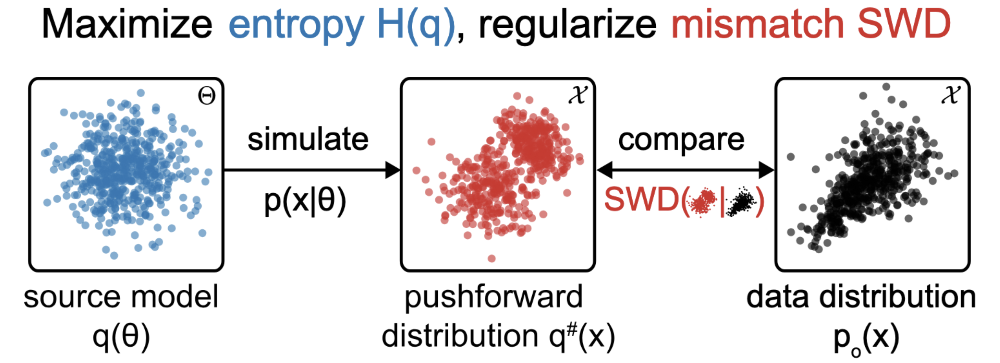

# Sourcerer

This is the repository for the paper ["Sourcerer: Sample-based Maximum Entropy Source Distribution Estimation"](https://arxiv.org/abs/2402.07808).

<div align="center">
  
</div>

## Installation
Install all dependencies with `pip install -e .`

## Running TM, IK, SLCP, GM or SIR, Lotka-Volterra tasks:
`hydra` is used for configuration management and command line interface.

You can run all benchmark tasks either from the command line or interactively (with VSCode cells or Jupyter notebooks) using the `benchmark_simulator_script`.

To run them interactively, overwrite the `local_overrides` list with your desired configuration. 

Alternatively, you can run the script from the command line: `python3 benchmark_simulator_script.py simulator=two_moons` (as an example, the `two_moons` task is selected here).

By default, results will be saved in `results_sourcerer`.


## Running the Hodgkin-Huxley experiment
To run the Hodgkin-Huxley experiment, the public dataset from Scala et al. (2020) is required. The dataset can be downloaded from `https://dandiarchive.org/dandiset/000008/draft`.

Alternatively, a preprocessed dataset along with a set of simulations to train the surrogate is publicly available at `https://github.com/berenslab/hh_sbi`.

To train the surrogate, use the `hh_sims_and_stats` script.
To perform source estimation after training the surrogate, use the `hh_script`.
Both can be run interactively using VSCode cells or Jupyter notebooks.

## Figures
Code for the figures can be found in the `figures` folder.
To reproduce the figures, it is necessary to first run the experiments and update the paths to point to the result files.

## References
Parts of this repository are based on code from the following public repositories:
- `https://github.com/berenslab/hh_sbi`
- `https://github.com/MaximeVandegar/NEB`

## Citation
```
@inproceedings{
  vetter2024sourcerer,
  title={Sourcerer: Sample-based Maximum Entropy Source Distribution Estimation},
  author={Julius Vetter and Guy Moss and Cornelius Schr{"o}der and Richard Gao and Jakob H. Macke},
  booktitle={The Thirty-eighth Annual Conference on Neural Information Processing Systems},
  year={2024},
  url={https://openreview.net/forum?id=0cgDDa4OFr}
}
```

